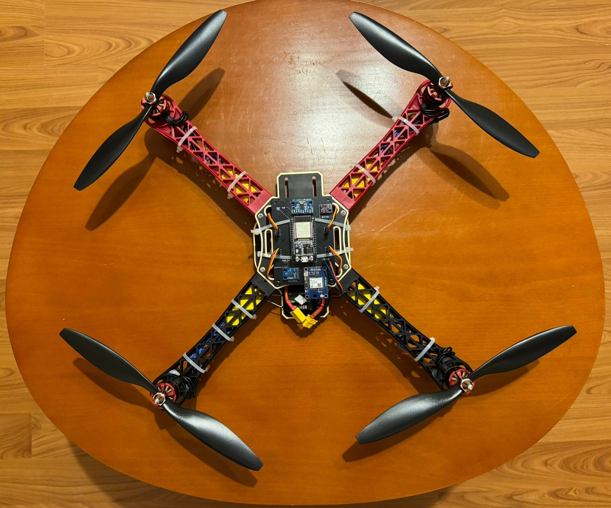

# ESP32 Drone Flight Controller

## 📖 **Overview**

**ESP32-Drone** is a DIY drone project using an **ESP32-WROOM-32** microcontroller as a fully custom flight controller. It involves detailed integration and programming of sensors, motor controllers (ESCs), remote control receivers, and stabilization algorithms to achieve controlled drone flight.



## 🛠️ **Key Features**

-   ⚙️ **Custom ESP32 Flight Controller** (fully programmable using VS Code & PlatformIO)
-   📡 **Sensors Integrated**:
    -   **MPU6500** (6-axis Gyroscope & Accelerometer)
    -   **HMC5883L** Magnetometer (heading/direction)
-   📻 **Remote Control**: FlySky FS-i6 transmitter & FS-iA6B receiver (iBus serial connection)
-   🚁 **Motors & ESC**: 2212 920KV Brushless motors & 30A ESCs controlled via PWM signals.
-   🧭 **PID Stabilization** (active)
-   🔄 **Sensor Fusion Algorithm** (Complementary filter implemented)
-   🧰 **Development Environment**: PlatformIO in Visual Studio Code

## 📋 **Components Used**

| Component                           | Model                    |
| ----------------------------------- | ------------------------ |
| Microcontroller (Flight Controller) | ESP32-WROOM-32           |
| Frame                               | F450 Quadcopter          |
| Motors                              | DJI 2212 920KV           |
| ESCs                                | 30A                      |
| Propellers                          | 1045 (10") CW & CCW      |
| Battery                             | LiPo 4S (14.8V, 1550mAh) |
| Power Distribution                  | Matek PDB BEC 5V/12V     |
| Transmitter & Receiver              | FlySky FS-i6 + FS-iA6B   |
| Sensors                             | MPU6500, HMC5883L        |

## 🚀 **Current Progress**

-   ✅ **ESP32 initial setup (PlatformIO environment)**
-   ✅ **Sensor Integration** _(IMU + Magnetometer)_
-   ✅ **Motor & ESC Testing (PWM signals tested successfully)**
-   ✅ **Remote control integration (iBus RX2 serial working)**
-   ✅ **Sensor Fusion (Complementary filter fully operational)**
-   ✅ **PID Stabilization (base tuning underway)**
-   🚁 **Hover & Flight Testing** (next focus)

## 📂 **Project Structure**

```
ESP32-Drone-Dev/
│
├── include/                          # Header files
│   ├── config.h
│   ├── motors.h
│   ├── pid.h
│   ├── receiver.h
│   ├── sensor_fusion.h
│   ├── sensors.h
│   └── README.md
│
├── lib/                              # Libraries for sensors/modules
│   └── README.md
│
├── src/                              # Main application source code
│   ├── main.cpp                      # Main control loop
│   ├── motors.cpp                    # Motor PWM control
│   ├── pid.cpp                       # PID calculations
│   ├── receiver.cpp                  # iBus receiver parsing
│   ├── sensor_fusion.cpp             # Sensor fusion (IMU + magnetometer)
│   ├── sensors.cpp                   # Sensor initialization/setup
│   └── utils.cpp                     # Utility functions
│
├── component_tests/                  # Individual hardware tests
│   ├── calibrate_qmc5883l.cpp        # Magnetometer calibration
│   ├── test_bmp280.cpp               # BMP280 sensor tests
│   ├── test_esc_motors.cpp           # ESC & Motor PWM tests
│   ├── test_fs_ia6b.cpp              # FlySky FS-iA6B receiver tests
│   ├── test_gps_neo6m.cpp            # GPS sensor tests
│   ├── test_hmc5883l.cpp             # Magnetometer tests
│   ├── test_mpu6500.cpp              # IMU sensor tests
│   └── test_sensor_fusion.cpp        # Full sensor fusion test
│
├── test/                             # General testing directory
│   └── README.md
│
├── .gitignore                        # Git ignore rules
├── platformio.ini                    # PlatformIO project configuration
└── README.md                         # Project documentation
```

## 🔧 **How to Run & Test the Project**

### **Step 1: Development Setup**

-   Install [VS Code](https://code.visualstudio.com/) and [PlatformIO extension](https://platformio.org/platformio-ide).
-   Clone and open this project in VS Code.

```bash
git clone https://github.com/Ionutz-dev/ESP32-Drone-Dev.git
cd ESP32-Drone-Dev
```

### **Build & Upload (PlatformIO)**

-   Connect ESP32 via USB.
-   Click **PlatformIO → Build** and then **PlatformIO → Upload**.

### **Serial Monitor (for debugging)**

Use PlatformIO's built-in Serial Monitor:

```bash
platformio device monitor
```

## 📌 **Next Steps & Planned Improvements**

-   PID tuning refinement and stabilization.
-   Conduct initial controlled hover flight tests.
-   Integrate barometric altitude hold (BMP280 - optional).
-   Explore GPS-based navigation (optional - NEO-6M module).
-   Implement failsafe mechanisms.

_Feel free to reach out if you have questions or feedback about this project!_
